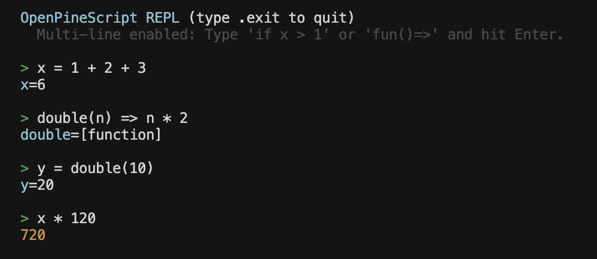

# OpenPineScript

An open-source engine that runs Pine Script locally. It compiles `.pine` source to
JavaScript and executes it against your own OHLCV data — no cloud account, no
execution quotas, no 500 ms loop timeout.

Requires Node.js 20+.

## Status

**Pine Script v2 is implemented and passing 228 tests.** That covers the full v2
language, roughly 130 standard-library functions, the strategy broker emulator,
multi-timeframe `security()`, and the real-time tick model.

| Version | State |
|---------|-------|
| v1 | Planned — v1 is semantically identical to v2, so this is mostly version routing |
| **v2** | **Implemented** |
| v3 | Planned — a five-item delta from v2 |
| v4 | Planned — `var`, `while`, `switch`, arrays, drawings, namespace migration |
| v5 | Planned — `ta.*`/`math.*` namespaces, matrices, maps, user-defined types, libraries |

The plan for v1–v5 lives in [dev-docs/](dev-docs/): an
[architecture assessment](dev-docs/00-architecture-assessment.md), a
[version delta spec](dev-docs/01-version-delta-spec.md) sourced from
TradingView's migration guides, and a
[16-iteration roadmap](dev-docs/02-roadmap.md).

## Install

```bash
git clone https://github.com/be-thomas/OpenPineScript.git
cd OpenPineScript
npm install
```

`npm install` runs `generate:parser`, which builds the ANTLR parser from
`grammar/`.

## Run a script

```bash
npm run opsv2 -- <script.pine> --data <data.csv> [flags]
```

```bash
npm run opsv2 -- sma_crossover.pine --data mock_data/AAPL_mock.csv
```

```
Compiling: sma_crossover.pine...
Running backtest: 506 bars...
✔ Done.

=== sma_crossover.pine — Summary ===
Bars processed : 506
Plots recorded : 1
```

### REPL

```bash
npm run replv2
```



### Inspect the generated JavaScript

```bash
npm run opsv2 -- sma_crossover.pine --data mock_data/AAPL_mock.csv --show-transpiled
```

```js
let opsv2_len = ctx.new_var("opsv2_len", 14);
let opsv2_src = ctx.new_var("opsv2_src", opsv2_close);
let opsv2_mySma = ctx.new_var("opsv2_mySma", ctx.call("sma@L4:C8", opsv2_sma, opsv2_src, opsv2_len));
ctx.call("plot@L6:C0", opsv2_plot, opsv2_mySma, { opsv2_color: opsv2_color.opsv2_red });
```

Every identifier is prefixed to avoid collisions with the sandbox, and every
stateful call carries its source location so per-call-site state (indicator
lookback buffers, for example) stays independent.

### Export results

```bash
npm run opsv2 -- strategy.pine --data data.csv --out-dir ./results
```

```
results/
├── chart.csv       OHLCV plus one column per plot()
├── trades.csv      entry and exit rows per trade
└── summary.json    performance metrics
```

### Compare against a TradingView export

Point `--compare-dir` at a folder holding `chart_data.csv`, `trades.csv`, and
`summary.json` exported from TradingView:

```bash
npm run opsv2 -- strategy.pine --data data.csv \
  --out-dir ./results \
  --compare-dir ./tv_exports
```

```
=== Comparison Report ===
Overall: PARTIAL    Tolerance: 0.0001

Chart Data: PASS  (506 rows compared, 0 mismatches)
Trades:     FAIL  (38 tv / 37 opsv2 — 1 discrepancy)
  Trade #42: exit_price_mismatch  tv=45000.5000  opsv2=45001.0000  Δ=0.5
Summary:    PASS  (net profit Δ 0.05%)

Report written: ./results/comparison_report.json
```

Every flag — `--out-chart`, `--out-trades`, `--compare-chart`, `--tolerance`,
`--input`, `--dry-run` — is documented in the [CLI Usage Guide](CLI-Usage.md).

## Tests

```bash
npm test
```

228 tests across 77 suites. The suite covers lexer token streams, parser trees,
transpiler output, and runtime behaviour. Technical-analysis functions are
checked differentially: `tests/v2/ta/naive_ta.ts` is an independent naive
reimplementation of the TA library, and the engine is asserted to match it
bar-for-bar rather than against hand-picked expected values.

## Repository layout

| Path | Contents |
|------|----------|
| `grammar/` | ANTLR lexer and parser grammars (`.g4`) |
| `lexer/` | Token source that turns indentation into block tokens |
| `parser/` | Generated ANTLR parser and the parse entry point |
| `transpiler/` | Parse tree to JavaScript |
| `runtime/` | Execution context, series storage, standard library, broker emulator |
| `repl/` | Interactive REPL |
| `mock_run/` | CLI runner |
| `utils/` | Shared helpers and the TradingView comparison engine |
| `tests/` | Test suites |
| `validation/` | Real-world Pine scripts used for parity checking |
| `spec/` | Language specification and per-version progress checklists |
| `dev-docs/` | Development plan for v1–v5 |
| `mock_data/` | Sample OHLCV data |

## Deliberate deviations from TradingView

TradingView enforces limits that protect a shared cloud tier. Running locally,
those limits are not parity — they are rationing. The engine skips them:

- **No 500 ms loop timeout** and no cumulative execution cap. A genuine infinite
  loop will hang the process.
- **No plot limit.** TradingView allows 64.
- **No `max_bars_back` window.** Lookback depth is bounded by available memory.
- **No script size limits.**

Semantic rules — the ones that would silently change your numbers — are
enforced, not skipped. Every skipped item is recorded with its blast radius in
[dev-docs/04-skipped-restrictions.md](dev-docs/04-skipped-restrictions.md).

## Contributing

The core is developed by a single author and pull requests are not being
accepted, but bug reports and feature requests drive the roadmap. See
[CONTRIBUTING.md](CONTRIBUTING.md), the
[Code of Conduct](CODE_OF_CONDUCT.md), and the
[Security Policy](SECURITY.md).

## License

GNU GPL-3.0. See [LICENSE](LICENSE).
